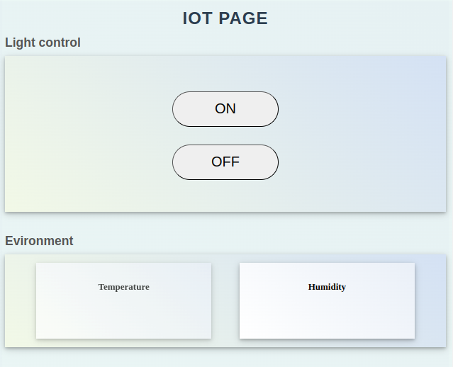
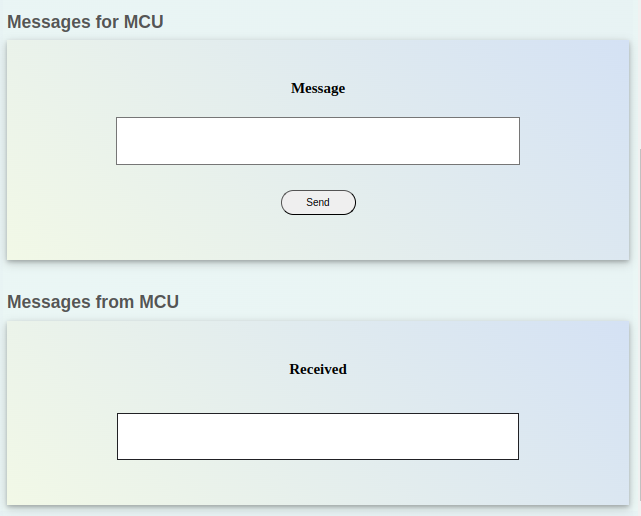
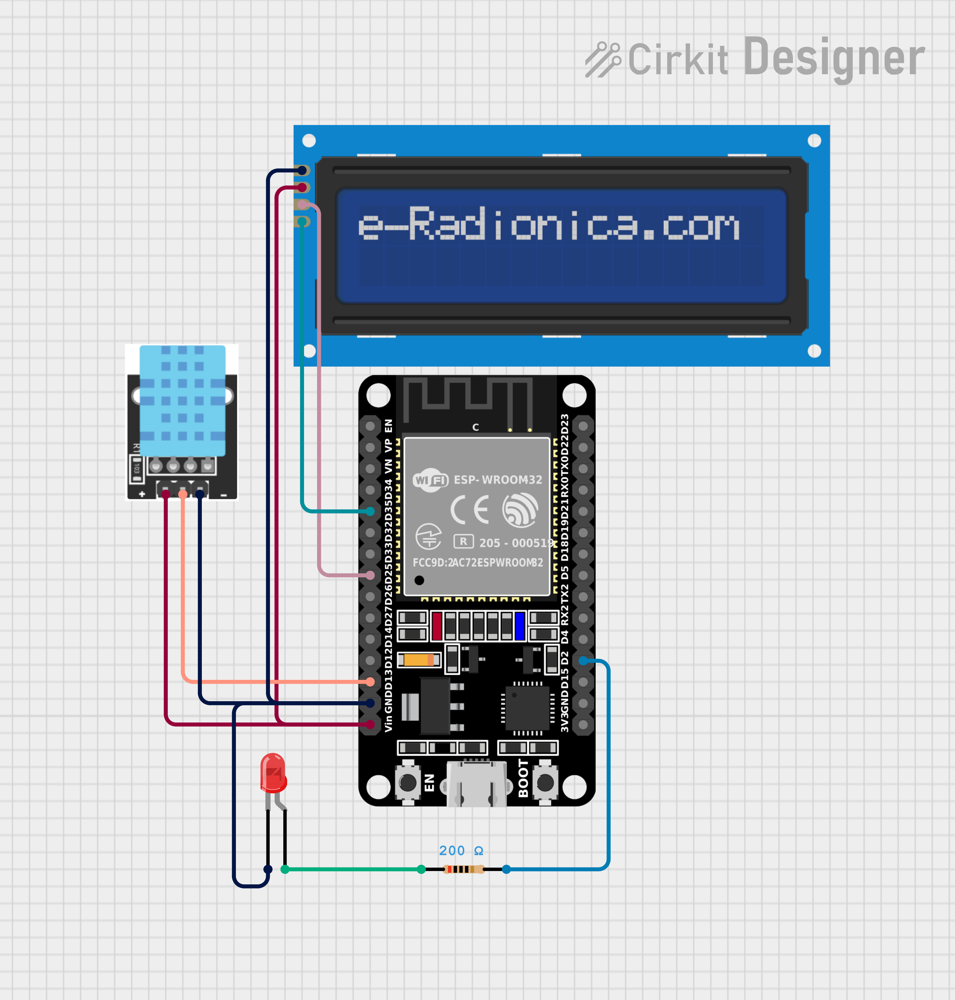

# WiFi Communication

Este projeto é uma página web para controle e monitoramento de dispositivos IoT via comunicação WiFi, utilizando um ESP32. A página permite controlar LEDs, visualizar dados de temperatura e umidade em tempo real, e exibir mensagens recebidas em um display LCD1602.


## Funcionalidades

- Controle de LEDs (ligar/desligar)
- Monitoramento de temperatura e umidade usando um sensor KY-015 DHT
- Exibição de mensagens recebidas em um display LCD1602
- Envio e recepção de mensagens para e do MCU (ESP32)
- Interface IOT
<p
    align="center"
>
    
    
</p>

## Tecnologias Usadas para a Interface IOT

A interface IOT deste projeto foi desenvolvida utilizando as seguintes tecnologias:

- **HTML**: Utilizado para estruturar a página web. A estrutura HTML define os elementos da interface, como botões, campos de texto e seções de exibição de dados.
- **CSS**: Utilizado para estilizar a página web, tornando-a visualmente atraente e responsiva. O CSS define o layout, cores, fontes e outros aspectos visuais da interface.
- **JavaScript**: Utilizado para adicionar interatividade à página web. O JavaScript é responsável por atualizar os dados de temperatura, umidade e mensagens em tempo real, além de enviar comandos para o ESP32.

### Implementação

A estrutura HTML, CSS e JavaScript é gerada pelo ESP32 e enviada para o cliente. O código HTML, CSS e JavaScript está embutido dentro do arquivo `project/include/html.hpp`, na função [`getPage`](project/include/html.hpp#L12). Esta função retorna uma string contendo todo o código necessário para a interface IOT, que é servida pelo ESP32 quando o cliente acessa a página web.

## Estrutura do Software do Projeto

- `template/index.html`: Página principal com a interface do usuário.
- `project/include/html.hpp`: Estrutura HTML gerada pelo ESP32.
- `project/src/main.cpp`: Código fonte principal para o ESP32.
- `project/include/lib.hpp`: Arquivo header com definições, bibliotecas usadas e declaração de funções para ESP32.
- `project/src/lib.cpp`: Implementação das funções para o ESP32.
- `project/platformio.ini`: Arquivo de configuração do PlatformIO.

## Estrutura do Hardware do Projeto

<p
    align="center"
>
    
</p>

## Como Usar

1. Clone o repositório:
    ```bash
    git clone https://github.com/seu-usuario/WiFi_communication.git
    ```
2. Navegue até o diretório do projeto:
    ```bash
    cd WiFi_communication
    ```
    
### Configuração do ESP32

1. Instale o PlatformIO:
    ```bash
    pip install platformio
    ```

2. Modifique o arquivo platform.ini para o modelo de sua ESP32 ( informação determinada na linha 13 )
    ```
    board = esp-wrover-kit
    ```

3. Modifique o arquivo `lib.hpp` para usar sua rede WiFi:
    ```cpp
    MOD_LIB const String ssidRounter =  "Nome da sua rede WiFi";          
    MOD_LIB const String passwordRounter =  "Senha da sua rede WiFi";
    ```

4. Conecte seu ESP32 ao computador, com o cabo adequado ao respectivo modelo.

5. Compile e faça o upload do código para o ESP32:
    ```bash
    platformio run --target upload
    ```

6. Abra o monitor serial para verificar a saída:
    ```bash
    platformio device monitor
    ```

7. No monitor serial será informado o IP da sua ESP32. Após a conexão ser concluida, para acessar a página, é necessário digitar o link do IP no navegador. Como exemplo para o IP 192.168.0.16
    ```baseh
    http://192.168.0.16/
    ```
## Uso do Monitor Serial

### Recepção e envio de mensagens
O monitor serial é útil para acompanhar as mensagens impressas pelo ESP32, como a inicialização do servidor e as mensagens enviadas e recebidas pelo microcontrolador. 

### Implementação no projeto
No código, a função [`setupMonitor`](project/src/lib.cpp#L20) (definida em [lib.cpp](project/src/lib.cpp)) inicia a comunicação serial com uma taxa de 115200.


## Exemplos de Uso

### Controle de LEDs

Na seção "Light control", você pode ligar ou desligar os LEDs conectados ao ESP32 usando os botões "ON" e "OFF".

### Monitoramento de Temperatura e Umidade

Na seção "Environment", você pode visualizar os dados de temperatura e umidade em tempo real, coletados pelo sensor KY-015 DHT conectado ao ESP32.

### Exibição de Mensagens no LCD1602

As mensagens recebidas pelo ESP32 são exibidas no display LCD1602 conectado ao microcontrolador.

### Envio de Mensagens

Na seção "Messages for MCU", você pode enviar mensagens para o ESP32.

### Recepção de Mensagens

Na seção "Messages from MCU", você pode visualizar as mensagens recebidas do ESP32.

## Bibliotecas Utilizadas

As seguintes bibliotecas foram utilizadas no projeto e estão incluídas no arquivo `header.h`:

- `Arduino.h`: Utilização de funções da ArduinoIDE.
- `WiFi.h`: Criação de servidor WiFi.
- `WebServer.h`: Criação de servidor web.
- `html.h`: Estrutura HTML gerada pelo ESP32.
- `Adafruit_Sensor.h`: Uso de sensores da Adafruit.
- `DHT.h`: Uso do sensor DHT.
- `DHT_U.h`: Uso do sensor DHT com a biblioteca unificada da Adafruit.
- `LiquidCrystal_I2C.h`: Uso do display LCD1602.
- `Wire.h`: Comunicação I2C.

Essas bibliotecas são essenciais para o funcionamento do projeto, permitindo a comunicação WiFi, controle de LEDs, monitoramento de temperatura e umidade, e exibição de mensagens no display LCD1602.

## Contribuição

1. Faça um fork do projeto
2. Crie uma branch para sua feature (`git checkout -b feature/nova-feature`)
3. Commit suas mudanças (`git commit -am 'Adiciona nova feature'`)
4. Faça um push para a branch (`git push origin feature/nova-feature`)
5. Abra um Pull Request

## Licença

Este projeto está licenciado sob a Licença MIT. Veja o arquivo [LICENSE](LICENSE) para mais detalhes.
